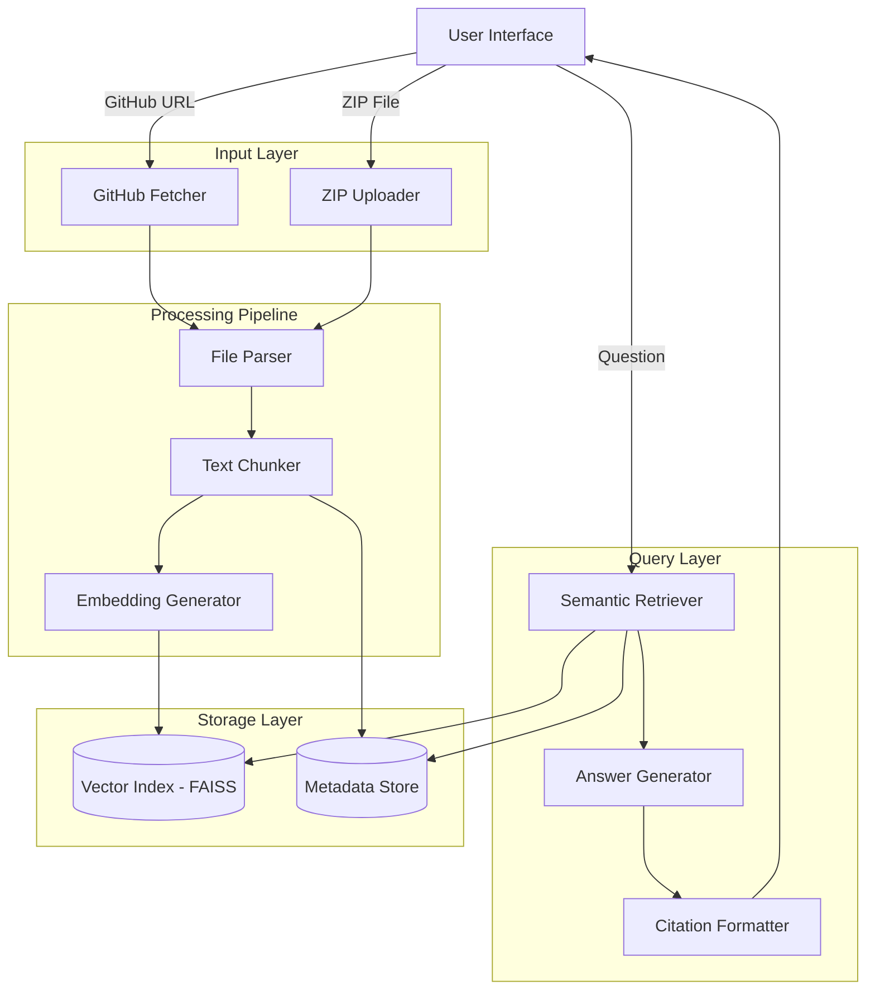

# Design Document: Codebase Buddy

## Overview

Codebase Buddy is a retrieval-augmented generation (RAG) system that helps developers quickly understand and debug unfamiliar codebases. The system accepts a public GitHub repository URL or uploaded ZIP file, indexes the content using embeddings and vector search, and answers user questions by retrieving relevant code and documentation chunks with citations.

The architecture follows a pipeline approach:
1. **Ingestion**: Fetch and extract repository content
2. **Processing**: Parse files, chunk text, and generate embeddings
3. **Indexing**: Store embeddings in a vector database (FAISS)
4. **Query**: Retrieve relevant chunks and generate answers with citations

The system prioritizes accuracy through strict grounding in retrieved context, preventing hallucinations by refusing to answer when information is not found in the repository.

## Why Artificial Intelligence Is Central to the Design

Codebase understanding and debugging require semantic reasoning across multiple files, natural-language explanations, and synthesis of dispersed information. These tasks cannot be reliably solved using rule-based systems or keyword search alone.

The design leverages Large Language Models (LLMs) with Retrieval-Augmented Generation (RAG) to:

- Interpret developer questions in natural language
- Retrieve semantically relevant code and documentation
- Synthesize multi-file context into concise explanations
- Explain error stack traces using contextual understanding

AI is therefore a core enabler of the system rather than an optional component.


## Architecture

### High-Level Architecture



## End-to-End Data Flow

1. User provides GitHub URL or ZIP file  
2. Repository is cloned/extracted locally  
3. Files are filtered and parsed into text  
4. Text is chunked with metadata  
5. Embeddings are generated for each chunk  
6. Embeddings are stored in FAISS index  
7. User submits a question or stack trace  
8. Question is embedded  
9. Top-k relevant chunks are retrieved  
10. Retrieved chunks + question are sent to LLM  
11. LLM generates grounded answer with citations  
12. Answer and sources are returned to user


### Component Responsibilities

1. **Input Layer**: Handles repository acquisition from GitHub or ZIP files
2. **Processing Pipeline**: Transforms raw files into searchable embeddings
3. **Storage Layer**: Persists embeddings and metadata for fast retrieval
4. **Query Layer**: Retrieves relevant context and generates grounded answers

### Technology Stack

- **Embedding Model**: Amazon Bedrock Embeddings (Titan) or sentence-transformers (fallback)
- **Vector Database**: FAISS for efficient similarity search
- **LLM**: Amazon Bedrock LLM (Claude / Llama) or equivalent
- **File Processing**: Python with `gitpython`, `zipfile`, and text parsing libraries
- **Web Framework**: FastAPI or Flask for API endpoints
- **Frontend**: Simple web UI (React or vanilla JS) for demo purposes

### Retrieval Strategy

**Top-K Similarity Search**:
1. Convert user question to embedding vector
2. Perform cosine similarity search in FAISS index
3. Retrieve top-k chunks (default k=5 for questions, k=10 for stack traces)
4. Return chunks sorted by similarity score (highest first)

**Optional Reranking** (future enhancement):
- After initial retrieval, use a cross-encoder model to rerank results
- Improves precision by considering query-document interaction
- Trade-off: adds latency but improves relevance

**Retrieval Parameters**:
- `k`: Number of chunks to retrieve (configurable, default 5)
- `similarity_threshold`: Minimum similarity score (default 0.3)
- `max_tokens`: Maximum total tokens from retrieved chunks (default 2000)

### LLM Prompt Template

The system uses a strict prompt template to enforce grounding and citations:

```
You are a helpful assistant that answers questions about a code repository.

STRICT RULES:
1. You MUST base your answer ONLY on the provided context chunks below
2. You MUST cite the file path for every piece of information you use
3. If the context does not contain enough information to answer the question, you MUST respond with: "Not found in repository context. You might want to check: [suggest relevant files or documentation]"
4. DO NOT use external knowledge or make assumptions beyond what is in the context
5. Format citations as [file_path:lines X-Y] inline with your answer

CONTEXT CHUNKS:
{retrieved_chunks}

USER QUESTION:
{user_question}

ANSWER:
```

**Citation Enforcement**:
- Post-process LLM output to verify citations are present
- If no citations found, reject answer and retry with stronger prompt
- Log cases where grounding fails for monitoring

## Components and Interfaces

### 1. Repository Ingestion Module

**Purpose**: Fetch and extract repository content from GitHub or ZIP files.

**Components**:

#### GitHubFetcher
```python
class GitHubFetcher:
    def fetch_repository(url: str) -> Repository:
        """
        Clones a public GitHub repository to a temporary directory.
        
        Args:
            url: Public GitHub repository URL
            
        Returns:
            Repository object with local path
            
        Raises:
            InvalidURLError: If URL is not a valid GitHub repository
            AccessError: If repository is private or inaccessible
        """
```

#### ZIPUploader
```python
class ZIPUploader:
    def extract_zip(file_path: str) -> Repository:
        """
        Extracts a ZIP file to a temporary directory.
        
        Args:
            file_path: Path to uploaded ZIP file
            
        Returns:
            Repository object with extracted content path
            
        Raises:
            InvalidZIPError: If file is not a valid ZIP archive
            ExtractionError: If extraction fails
        """
```

#### Repository
```python
class Repository:
    path: str  # Local filesystem path to repository
    source: str  # "github" or "zip"
    metadata: dict  # Repository name, size, file count, etc.
```

### 2. File Processing Module

**Purpose**: Parse repository files, filter irrelevant content, and extract text.

**Components**:

#### FileParser
```python
class FileParser:
    IGNORED_PATTERNS = [
        "node_modules/", "vendor/", ".git/", "__pycache__/",
        "*.pyc", "*.so", "*.dll", "*.exe", "*.bin",
        "*.jpg", "*.png", "*.gif", "*.pdf"
    ]
    
    def parse_repository(repo: Repository) -> List[ParsedFile]:
        """
        Walks repository directory and extracts text from relevant files.
        
        Args:
            repo: Repository object with local path
            
        Returns:
            List of ParsedFile objects with content and metadata
        """
    
    def should_ignore(file_path: str) -> bool:
        """
        Determines if a file should be ignored based on patterns.
        
        Args:
            file_path: Relative path to file in repository
            
        Returns:
            True if file should be ignored, False otherwise
        """
    
    def read_file_content(file_path: str) -> str:
        """
        Reads text content from a file with encoding detection.
        
        Args:
            file_path: Absolute path to file
            
        Returns:
            Text content of file
            
        Raises:
            EncodingError: If file encoding cannot be determined
        """
```

#### ParsedFile
```python
class ParsedFile:
    path: str  # Relative path in repository
    content: str  # Text content
    size: int  # File size in bytes
    language: str  # Programming language (detected from extension)
```

### 3. Chunking Module

**Purpose**: Split large files into manageable chunks with metadata for retrieval.

**Components**:

#### TextChunker
```python
class TextChunker:
    CHUNK_SIZE = 512  # tokens
    CHUNK_OVERLAP = 50  # tokens
    
    def chunk_files(files: List[ParsedFile]) -> List[Chunk]:
        """
        Splits files into overlapping chunks with metadata.
        
        Args:
            files: List of parsed files
            
        Returns:
            List of Chunk objects with content and metadata
        """
    
    def chunk_text(text: str, file_path: str) -> List[Chunk]:
        """
        Splits a single file's text into chunks.
        
        Args:
            text: File content
            file_path: Path to file for metadata
            
        Returns:
            List of chunks from this file
        """
```

#### Chunk
```python
class Chunk:
    id: str  # Unique identifier (hash of content + metadata)
    content: str  # Text content of chunk
    file_path: str  # Source file path
    chunk_index: int  # Position in file (0-indexed)
    start_line: int  # Starting line number in original file
    end_line: int  # Ending line number in original file
    token_count: int  # Number of tokens in chunk
```

### 4. Embedding and Indexing Module

**Purpose**: Generate embeddings and build vector index for semantic search.

**Components**:

#### EmbeddingGenerator
```python
class EmbeddingGenerator:
    def __init__(model_name: str = "all-MiniLM-L6-v2"):
        """
        Initializes embedding model.
        
        Args:
            model_name: HuggingFace model identifier
        """
    
    def generate_embeddings(chunks: List[Chunk]) -> List[Embedding]:
        """
        Generates embedding vectors for all chunks.
        
        Args:
            chunks: List of text chunks
            
        Returns:
            List of Embedding objects with vectors
        """
    
    def embed_text(text: str) -> np.ndarray:
        """
        Generates embedding vector for a single text.
        
        Args:
            text: Input text
            
        Returns:
            Embedding vector as numpy array
        """
```

#### VectorIndex
```python
class VectorIndex:
    def __init__(dimension: int):
        """
        Initializes FAISS index.
        
        Args:
            dimension: Embedding vector dimension
        """
    
    def add_embeddings(embeddings: List[np.ndarray], metadata: List[Chunk]):
        """
        Adds embeddings to index with associated metadata.
        
        Args:
            embeddings: List of embedding vectors
            metadata: List of chunk metadata objects
        """
    
    def search(query_embedding: np.ndarray, k: int = 5) -> List[SearchResult]:
        """
        Searches for top-k most similar chunks.
        
        Args:
            query_embedding: Query vector
            k: Number of results to return
            
        Returns:
            List of SearchResult objects with chunks and similarity scores
        """
    
    def save(path: str):
        """Persists index to disk."""
    
    def load(path: str):
        """Loads index from disk."""
```

#### SearchResult
```python
class SearchResult:
    chunk: Chunk  # Retrieved chunk
    score: float  # Similarity score (0-1)
```

### 5. Query and Answer Generation Module

**Purpose**: Process user questions, retrieve context, and generate grounded answers.

**Components**:

#### QueryProcessor
```python
class QueryProcessor:
    def __init__(embedding_generator: EmbeddingGenerator, 
                 vector_index: VectorIndex,
                 llm_client: LLMClient):
        """
        Initializes query processor with dependencies.
        """
    
    def answer_question(question: str, k: int = 5) -> Answer:
        """
        Answers a user question using retrieved context.
        
        Args:
            question: User's question
            k: Number of chunks to retrieve
            
        Returns:
            Answer object with response and citations
        """
    
    def explain_stack_trace(stack_trace: str, k: int = 10) -> Answer:
        """
        Explains a stack trace using repository context.
        
        Args:
            stack_trace: Error stack trace text
            k: Number of chunks to retrieve
            
        Returns:
            Answer object with explanation and file pointers
        """
```

#### LLMClient
```python
class LLMClient:
    def generate_answer(question: str, context: List[Chunk]) -> str:
        """
        Generates answer using LLM with strict grounding prompt.
        
        Args:
            question: User's question
            context: Retrieved chunks
            
        Returns:
            Generated answer text
        """
    
    def check_answer_grounded(answer: str, context: List[Chunk]) -> bool:
        """
        Verifies answer is grounded in provided context.
        
        Args:
            answer: Generated answer
            context: Retrieved chunks
            
        Returns:
            True if answer is grounded, False otherwise
        """
```

#### Answer
```python
class Answer:
    text: str  # Answer text
    citations: List[Citation]  # Source citations
    confidence: str  # "high", "medium", "low", or "not_found"
    retrieved_chunks: List[Chunk]  # Chunks used for answer
```

#### Citation
```python
class Citation:
    file_path: str  # Source file
    chunk_index: int  # Chunk position in file
    line_range: str  # "lines 10-25"
    relevance: float  # How relevant this citation is (0-1)
```

### 6. Citation Formatter

**Purpose**: Format citations in a clear, user-friendly manner.

**Components**:

#### CitationFormatter
```python
class CitationFormatter:
    def format_answer_with_citations(answer: Answer) -> str:
        """
        Formats answer text with inline and footer citations.
        
        Args:
            answer: Answer object
            
        Returns:
            Formatted string with answer and citations
        """
    
    def create_citation_list(citations: List[Citation]) -> str:
        """
        Creates a formatted list of citations.
        
        Args:
            citations: List of citation objects
            
        Returns:
            Formatted citation list string
        """
```

## Data Models

### Repository Metadata
```python
{
    "repo_id": "unique-hash",
    "name": "repository-name",
    "source": "github" | "zip",
    "url": "https://github.com/user/repo" | null,
    "indexed_at": "2024-01-15T10:30:00Z",
    "file_count": 150,
    "total_chunks": 1200,
    "languages": ["Python", "JavaScript", "Markdown"]
}
```

### Chunk Metadata

This is the core data structure stored for each chunk in the system:

```python
{
    "chunk_id": "sha256-hash",           # Unique identifier for deduplication
    "file_path": "src/main.py",          # Relative path in repository
    "chunk_index": 0,                    # Position in file (0-indexed)
    "start_line": 1,                     # Starting line number
    "end_line": 30,                      # Ending line number
    "content": "def main():\n    ...",   # Actual text content
    "token_count": 245,                  # Number of tokens
    "language": "Python",                # Detected programming language
    "embedding": [0.1, 0.2, ...],        # 384-dim vector (stored separately in FAISS)
    "repo_id": "unique-repo-hash"        # Links chunk to repository
}
```

**Storage Strategy**:
- Embeddings stored in FAISS index (efficient vector operations)
- Metadata stored in SQLite database (efficient filtering and retrieval)
- Content stored in metadata for display (no need to re-read files)

### Query Request
```python
{
    "repo_id": "unique-hash",
    "question": "How do I set up the development environment?",
    "k": 5  # optional, defaults to 5
}
```

### Query Response
```python
{
    "answer": "To set up the development environment...",
    "confidence": "high",
    "citations": [
        {
            "file_path": "README.md",
            "line_range": "lines 10-25",
            "relevance": 0.95
        },
        {
            "file_path": "docs/setup.md",
            "line_range": "lines 1-15",
            "relevance": 0.87
        }
    ],
    "processing_time_ms": 450
}
```

## Responsible AI Considerations

- System answers only from retrieved repository context
- Mandatory citations for every answer
- Clear “Not found in repository context” response
- No private repository access
- No code execution or modification
- User-facing disclaimer about limitations


## Risk Analysis and Mitigations

### Risk 1: LLM Hallucinations

**Description**: The LLM may generate plausible-sounding answers that are not grounded in the repository context.

**Impact**: High - Users may receive incorrect information and waste time following bad advice.

**Mitigations**:
- Strict prompt template enforcing "only use provided context"
- Mandatory citation requirement (reject answers without citations)
- Post-processing to verify citations reference actual retrieved chunks
- Confidence scoring based on retrieval similarity scores
- Clear "Not found in repository context" responses when information is unavailable
- User disclaimer that answers should be verified

### Risk 2: Large Repository Performance

**Description**: Very large repositories (10,000+ files) may take too long to index or exhaust memory.

**Impact**: Medium - System becomes unusable for large codebases, limiting applicability.

**Mitigations**:
- Focus MVP on small-to-medium repositories (demo scale)
- Implement file filtering to ignore irrelevant files (node_modules, binaries, etc.)
- Stream processing for chunking (don't load entire repo in memory)
- Set maximum repository size limit (e.g., 5000 files or 500MB)
- Display clear error message when limits exceeded
- Future: Implement incremental indexing for large repos

### Risk 3: Irrelevant Retrieval

**Description**: Vector search may retrieve chunks that are semantically similar but contextually irrelevant.

**Impact**: Medium - Answers may be off-topic or miss the most relevant information.

**Mitigations**:
- Tune chunk size and overlap for optimal context preservation
- Set similarity threshold to filter low-relevance results
- Retrieve more chunks (higher k) and let LLM select most relevant
- Include file path and language in chunk metadata for filtering
- Future: Implement hybrid search (vector + keyword) for better precision
- Future: Add reranking step with cross-encoder model

### Risk 4: Poor Chunking Quality

**Description**: Chunks may split code in awkward places, breaking semantic meaning.

**Impact**: Medium - Retrieval may miss relevant code or provide incomplete context.

**Mitigations**:
- Use language-aware chunking (respect function/class boundaries)
- Implement chunk overlap to preserve context across boundaries
- Include surrounding context in chunk metadata
- Test chunking with various file types and sizes
- Future: Use AST-based chunking for code files

### Risk 5: Embedding Model Limitations

**Description**: Embedding model may not capture code semantics well (trained on natural language).

**Impact**: Medium - Retrieval quality may be suboptimal for code-heavy queries.

**Mitigations**:
- Use code-aware embedding models (e.g., CodeBERT, GraphCodeBERT)
- Include both code and documentation in chunks for richer context
- Test with code-specific queries during development
- Future: Fine-tune embedding model on code-specific data

### Risk 6: API Rate Limits and Costs

**Description**: LLM API calls may hit rate limits or incur high costs with many users.

**Impact**: Low-Medium - System may become unavailable or expensive to operate.

**Mitigations**:
- Implement caching for repeated questions
- Set per-user rate limits
- Use smaller, cheaper models for initial demo (GPT-3.5 instead of GPT-4)
- Future: Implement local LLM option (e.g., Llama 2) for cost reduction

### Risk 7: Security and Privacy

**Description**: Users may accidentally upload private code or the system may be exploited.

**Impact**: High - Privacy violations or security breaches.

**Mitigations**:
- Clear disclaimer: "Only use public repositories or code you own"
- No authentication for private repos (explicitly not supported)
- Sandboxed file processing (no code execution)
- Read-only access to repositories
- Automatic cleanup of temporary files after processing
- Input validation to prevent path traversal attacks

## Hackathon Feasibility

The MVP can be implemented within the hackathon timeline by focusing on:

- Public GitHub repo ingestion
- FAISS-based vector search
- Single LLM model via Amazon Bedrock
- Simple web UI

This scope ensures a functional demo while leaving advanced optimizations as future work.


## Deployment Plan

### MVP Demo Deployment

**Target**: Local development or simple cloud hosting for hackathon demo

**Option 1: Local Development**
- Run FastAPI backend locally
- Serve frontend from local dev server
- Use local FAISS index (file-based)
- SQLite for metadata storage
- Suitable for: Development, testing, small demos

**Option 2: Simple Cloud Hosting**
- Deploy backend to Heroku, Railway, or similar PaaS
- Host frontend on Vercel or Netlify
- Store FAISS index and SQLite on persistent volume
- Use environment variables for API keys
- Suitable for: Public demo, small user base

**Infrastructure Requirements**:
- 2GB RAM minimum (for embedding model and FAISS)
- 10GB disk space (for repositories and indexes)
- Python 3.9+ runtime
- OpenAI API key (or alternative LLM provider)

**Deployment Steps**:
1. Set up Python environment with dependencies
2. Configure environment variables (API keys, storage paths)
3. Initialize embedding model (download on first run)
4. Start FastAPI server
5. Deploy frontend with API endpoint configuration
6. Test with sample public repository

**Monitoring**:
- Log all queries and responses for debugging
- Track indexing times and success rates
- Monitor API usage and costs
- Collect user feedback for improvements

**Future Scaling** (post-MVP):
- Migrate to managed vector database (Pinecone, Weaviate)
- Implement user authentication and multi-tenancy
- Add caching layer (Redis) for repeated queries
- Use message queue for async indexing jobs
- Deploy on Kubernetes for horizontal scaling

## Correctness Properties

*A property is a characteristic or behavior that should hold true across all valid executions of a system—essentially, a formal statement about what the system should do. Properties serve as the bridge between human-readable specifications and machine-verifiable correctness guarantees.*

